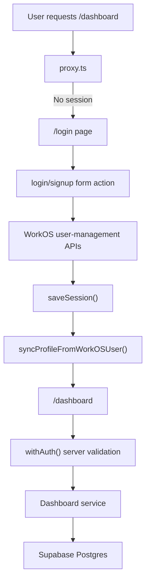

# Architecture

## Guiding Principles

- Keep auth and application data separate
- Prefer server-side validation for protected routes and database access
- Keep the initial foundation small and easy to extend
- Freeze product rules explicitly before implementing analysis logic

## High-Level Flow

## Folder Layout

### `app/`

- App Router pages and route handlers
- Public routes: `/`, `/login`, `/signup`
- Public API route: `/api/contact`
- Auth routes: `/auth/login`, `/auth/signup`, `/auth/callback`, `/auth/start`, `/auth/social/google`
- Protected route: `/dashboard`

### `components/`

- Shared UI and route-specific presentation components
- `components/brand/*` contains reusable brand assets such as the EnergyCurve logo lockup
- `components/dashboard/*` contains the interactive dashboard UI scaffolding used for the current product-direction preview
- `components/marketing/*` contains the public landing page shell, navbar, section components, locale toggle, and contact form UI
- `components/ui/*` contains the `shadcn/ui` base
- `components/providers/auth-provider.tsx` mounts `AuthKitProvider` in the root layout to cover WorkOS auth edge cases in the App Router

### `lib/`

- cross-cutting helpers and infrastructure utilities
- `lib/env.ts` validates required server environment variables
- `lib/auth/return-to.ts` sanitizes post-login return targets
- `lib/content/site-copy.ts` provides the locale-aware marketing copy dictionary for the landing page
- `lib/contact-form.ts` owns contact form sanitization and schema validation
- `lib/observability/logger.ts` provides structured server-side logging helpers
- `lib/product/strategy.ts` centralizes the frozen v1 product constants and rules
- `lib/rate-limit.ts` provides a small in-memory rate limiter for the public contact endpoint
- `lib/energy-curve-preview.ts` contains illustrative curve data and chart helpers used during the design pass
- `lib/supabase/server.ts` exposes the server-only Supabase client

### `services/`

- application data layer
- `profile-service.ts` syncs WorkOS users into app profiles
- `dashboard-service.ts` loads minimal dashboard data without adding product logic
- `contact-service.ts` handles public contact form submissions with a safe structured logging fallback

### `types/`

- shared TypeScript contracts
- database table types
- domain-level interfaces used by services

### `docs/`

- technical documentation for setup, architecture, and decisions

### `supabase/migrations/`

- SQL migration files for the application schema

## Auth Boundary

- WorkOS AuthKit owns identity, sessions, callback handling, and logout.
- Supabase does not manage authentication.
- The app bridges both systems through `profiles.workos_user_id`.

## Data Boundary

- Database access is currently server-only.
- `SUPABASE_SERVICE_ROLE_KEY` is confined to server modules.
- No browser-safe Supabase client is introduced in this phase.
- The recommended topology is one Supabase project for local/dev and another for production so WorkOS `Staging` identities never write into production data.

## Protected Routing Strategy

- `proxy.ts` handles request-time protection for `/dashboard`.
- The dashboard page validates access again with `withAuth()` on the server.
- `/login` and `/signup` redirect authenticated users back to `/dashboard`.
- Auth-boundary failures are caught and converted into a recoverable setup state instead of a raw runtime exception.

## Session Persistence

- WorkOS AuthKit stores the authenticated session in an encrypted cookie.
- `AuthKitProvider` is mounted in the root layout because WorkOS recommends it for Next.js auth edge cases.
- `proxy.ts` refreshes and forwards session context through AuthKit headers for matched routes.
- Server components read the authenticated user via `withAuth()` only on routes covered by the proxy.
- Logout uses WorkOS session termination and falls back to a safe redirect to `/` if logout initialization fails unexpectedly.
- Local development should use WorkOS `Staging`, while Vercel production should use WorkOS `Production`, so session identities stay aligned with their target environment.

## Schema Summary

- `profiles`
  - internal application profile
  - keyed by UUID
  - linked to WorkOS via `workos_user_id`

- `playlists`
  - belongs to `profiles`
  - stores playlist metadata only

- `tracks`
  - belongs to `playlists`
  - stores sequencing metadata plus a `1–10` energy score range aligned to strategy v1

## Security Notes

- Secrets are not read from client components.
- Protected data access is performed on the server.
- Callback failures redirect back to `/login` without exposing raw errors to the UI.
- RLS is enabled on all tables to block accidental browser access until policies are intentionally defined.
- The public contact form validates and sanitizes input on the server, includes a honeypot field, enforces basic same-origin checks, and rate-limits by client IP.
- Structured logging is centralized so auth, contact, and dashboard fallback paths emit consistent server-side events.
